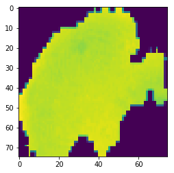
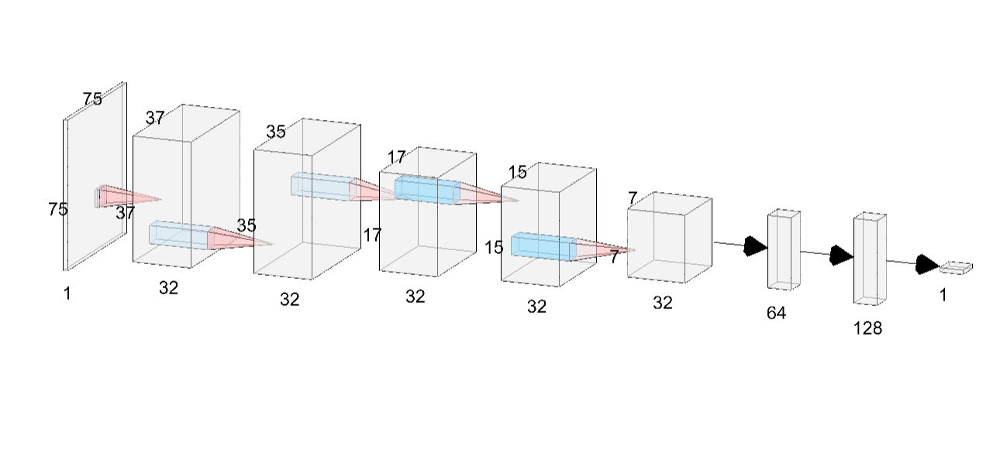

# Malaria Detection Using Deep Learning

Detection of malaria from raw cell images dataset obtained from the U.S. National Library of Medicine (https://ceb.nlm.nih.gov/repositories/malaria-datasets/).

Preview of a cell image:

Trying through multiple model architectures, I was able to get over 95% accuracy with validation split of 30% using following architecture. 
I have used a simple Convolutional Network with Dropout of 50% after each Fully Connected Layer.

Pre-trained model is included in the repository with the name '3-Con2D-X32-Dense-X64-Dense-X128.h5'.
